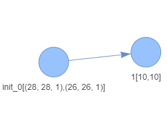
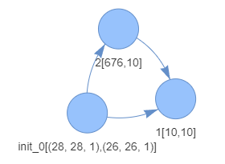
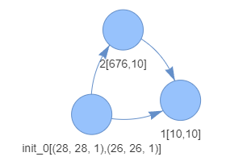
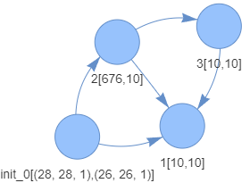

# Home Page

The growingnn project introduces an innovative algorithm for data-driven neural network model construction. This algorithm comprises two fundamental components: the first component focuses on weight adjustment, while the second component acts as an orchestrator, launching a guided procedure to dynamically change the network architecture. This architectural modification occurs at regular intervals, specifically every $K$ epochs, and is driven by the outcome of a Monte Carlo tree search. The algorithm's core, outlined in the accompanying research paper, leverages the principles of Stochastic Gradient Descent (SGD) without relying on advanced tools commonly used in neural network training.

## Algorithm Overview

### Weight Adjustment Component

The first component of the algorithm is dedicated to weight adjustment. It operates within the framework of Stochastic Gradient Descent (SGD), a foundational optimization algorithm for training neural networks. The simplicity of this approach makes it suitable for educational settings, emphasizing fundamental machine learning principles.

### Orchestrator and Network Architecture Modification

The second component, the orchestrator, plays a crucial role in initiating a procedure to dynamically change the network architecture. This change occurs systematically at predefined intervals, specifically every $K$ epochs. The decision-making process for architectural changes is facilitated by a guided Monte Carlo tree search. This sophisticated mechanism ensures that architectural modifications are well-informed and contribute to the overall improvement of the neural network model.

## Implementation Details

### Model Structure
The model is the main structure that stores layers as nodes in a directed graph. It operates based on layer identifiers, treating each layer as an independent structure that contains information about incoming and outgoing connections. The default starting structure is a simple graph with an input and output layer connected by a single connection. In each generation, the algorithm has the flexibility to add new layers or remove existing ones. As the structure grows, each layer gains more incoming and outgoing connections.

### Propagation Phase

During the propagation phase, each layer waits until it receives signals from all input layers. Once these signals are received, they are averaged, processed, and propagated through all outgoing connections. This iterative process allows the neural network to dynamically adapt its architecture based on the evolving data and training requirements.

## Results and Testing

The proposed algorithm has undergone rigorous testing, particularly in visual pattern classification problems. The results have consistently demonstrated high levels of satisfaction, showcasing the efficacy of the dynamic architecture learning approach in enhancing model performance.


```python
x_train, x_test, y_train, y_test, labels = data_reader.read_mnist_data(mnist_path, 0.9)
gnn.trainer.train(
    x_train = x_train, 
    y_train = y_train, 
    x_test = x_test,
    y_test = y_test,
    labels = labels,
    input_paths = 1,
    path = "./result", 
    model_name = "GNN_model",
    epochs = 10, 
    generations = 10,
    input_size = 28 * 28, 
    hidden_size = 28 * 28, 
    output_size = 10, 
    input_shape = (28, 28, 1), 
    kernel_size = 3, 
    depth = 2
)
```
This code trains a simple network on the MNIST dataset

## Structure
History of resulting optimal structure created for MNIST dataset:

1. 

2. 

3. 

4. 

History of training for mnist and fmnist dataset:


# Credits

Szymon Swiderski
Agnieszka Jastrzebska

# Disclosure

This is the first beta version of the growingnn package. We are not liable for the accuracy of the program’s output nor actions performed based upon it.

For more in-depth information on the algorithm, its implementation, and testing results, refer to the accompanying research paper. The provided Python source code is a valuable resource for understanding and implementing the presented method. Feel free to explore, contribute, and adapt it for your specific needs.