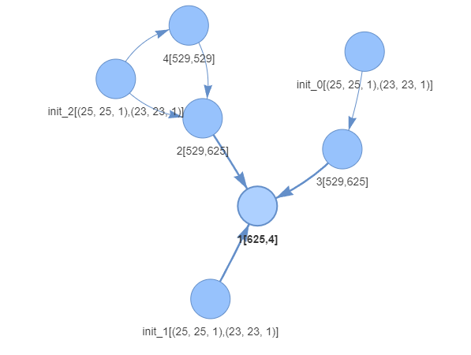

# Training the model

## Description:
The train function is a part of the growingnn package, which implements an innovative algorithm for data-driven neural network model construction. It trains a dynamic neural network architecture using the provided training and testing data. The algorithm incorporates weight adjustment and network architecture modification components, leveraging principles of Stochastic Gradient Descent (SGD) and Monte Carlo tree search.

## Parameters:
- `x_train`: numpy array, input training data.
- `x_test`: numpy array, input testing data.
- `y_train`: numpy array, target training data.
- `y_test`: numpy array, target testing data.
- `labels`: list, list of class labels.
- `path`: str, path to store model and history files.
- `model_name`: str, name of the model file.
- `epochs`: int, number of epochs for training.
- `generations`: int, number of generations for architecture modification. Total number od epochs is epochs * generations
- `input_size`: int, size of input layer, unused if input is convolution. If input_shape is than `None` input_size is unused 
- `hidden_size`: int, size of hidden layer. defult number of nuerons in layers created while training
- `output_size`: int, size of output layer.
- `input_shape`: tuple, shape of input data. If set to `None` it means that all input layers are Dense layers
- `kernel_size`: int, size of kernel for convolutional layers.
- `deepth`: int, amount of filters in the convolutional layer
- `batch_size`: int, size of mini-batch for training (default: 128).
- `simulation_set_size`: int, size of simulation set (default: 20).
- `simulation_alg`: function, simulation algorithm (default: montecarlo_alg).
- `sim_set_generator`: function, simulation set generator (default: create_simulation_set_SAMLE).
- `simulation_scheduler`: object, simulation scheduler (default: SimulationScheduler).
- `lr_scheduler`: object, learning rate scheduler (default: LearningRateScheduler).
- `loss_function`: function, loss function (default: multiclass_cross_entropy).
- `activation_fun`: function, activation function (default: Sigmoid).
- `input_paths`: int, number of input paths (default: 1).
- `sample_sub_generator`: function, sample sub-generator (default: None).
- `simulation_score`: object, simulation score (default: Simulation_score).


## Example:

Example for multivariate time series classification after transfering sereies to recurence plots. Thats why it is using convolution
```python
import growingnn as gnn
import lstm


sequence_length = pow(5, 2)
dataset_name = 'BasicMotions'
processed_data_name = 'processed_arff_augmented'
x_train, y_train, labels = lstm.load(processed_data_name+"/"+dataset_name + "_train.json")
x_test, y_test, labels = lstm.load(processed_data_name+"/"+dataset_name + "_test.json")
main_path_my = "./results/LSTM/"+dataset_name+'/'

gnn.trainer.train(x_train = x_train,
    y_train = y_train,
    x_test = x_test,
    y_test = y_test,
    labels = labels,
    input_paths = 3,
    path = main_path_my,
    model_name = "GNN_model", 
    epochs = 100,
    generations = 30,
    simulation_scheduler = gnn.SimulationScheduler(gnn.SimulationScheduler.PROGRESS_CHECK, simulation_time = 10, simulation_epochs = 10),
    simulation_alg = gnn.montecarlo_alg,
    sim_set_generator = gnn.simulation.create_simulation_set_SAMLE,
    lr_scheduler = gnn.LearningRateScheduler(gnn.LearningRateScheduler.PROGRESIVE, 0.03),
    input_size = sequence_length, # unused becouse we use convolution
    hidden_size = sequence_length * sequence_length,
    output_size = len(labels), 
    input_shape = (sequence_length, sequence_length, 1), 
    kernel_size = 3, 
    deepth = 1, 
    batch_size = 128, 
    simulation_set_size = 5,
    simulation_score = gnn.Simulation_score(gnn.Simulation_score.ACCURACY))
```

## Structure
Resulting optimal structure created for given problem:
